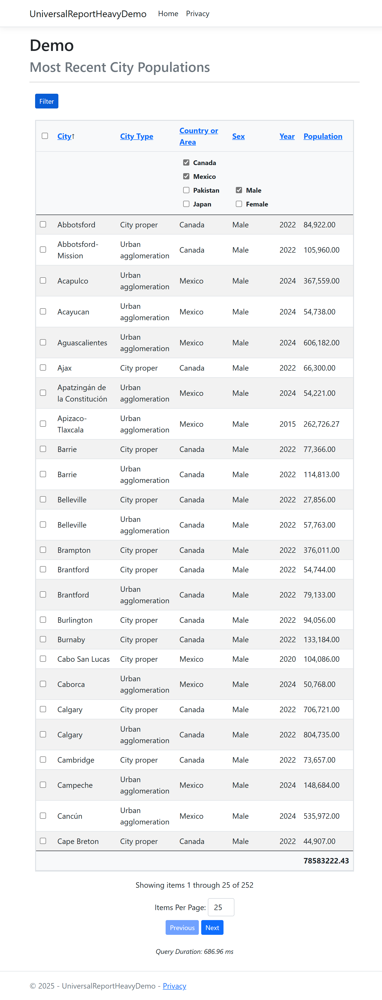

# Universal Report Core

A fast and versatile framework for presenting tabular data reports in ASP.NET Core.

## Documentation

[Documentation]https://tonybierman.github.io/Universal-Report-Core/

## Features

- **Faceted Browsing**: Define facets to filter data.
- **Paging**: Efficiently handle large datasets with built-in pagination.
- **Column Sorting**: Sort data by columns dynamically.
- **Column Aggregation**: Supports sum, average, count, min, and max operations.
- **Cohort Aggregation**: Aggregate data within user-defined subsets.

## Screen shot



## Installation

To install via NuGet:

```sh
dotnet add package BiermanTech.UniversalReportCore.Ui
```

Or add it to your `csproj` file:

```xml
<PackageReference Include="BiermanTech.UniversalReportCore.Ui" />
```

## Usage

### 1. Register report services in `Program.cs`

### 2. Create an entity that represents a row your report:

### 3. Define the report's columns

### 4. Define the base query for the report


## Contributing

Contributions are welcome! To contribute:

1. Fork the repository.
2. Create a new branch (`feature/new-feature`).
3. Submit a pull request.

## License

This project is licensed under the MIT License.

## Support

For questions or issues, open an [issue on GitHub](https://github.com/tonybierman/Universal-Report-Core/issues).
